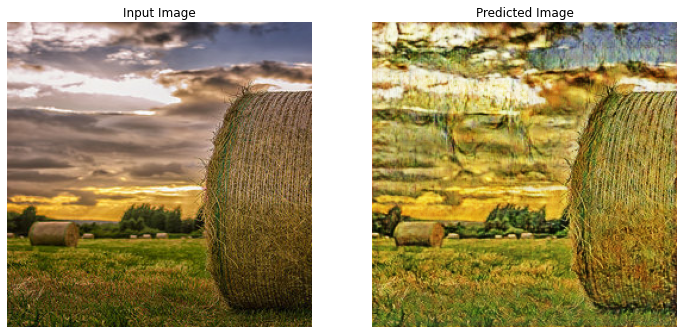
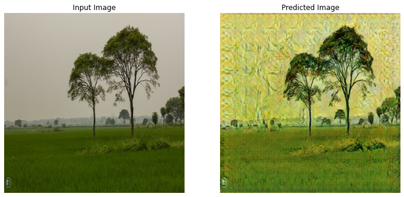

Artistic Style Transfer With CycleGAN :

* In this [notebook](https://colab.research.google.com/drive/19t6m05nv7gnVdRZMkD-XZnaWUIsKcKZF) we will explore the Artistry of the GANs , that is we will create Van Gogh Style pictures , by learning from his paintings and implement his ***Artistic*** style on Normal images. 

* Now what is GAN ? GANs are like a pair of a teacher and a student , in this case , the teacher is Van Gogh and the student is someone who knows painting. So , what the student does is , he pics a random picture from the internet , and tries to paint it but in Van Gogh's style. When he finishes the painting , Van Gogh judges the painting , and tells him if he did it right or wrong. Based on his assesment , the student improves their work.

* Then what is ***CycleGAN*** ??? CycleGAN is like , the student becomes the teacher for once and Van Gogh becomes the student , turn by turn. The student trying to copy Van Gogh , and Van Gogh trying to copy the students style of painting the normla pictures. Now you must be thinking , why does Van Gogh need to know how to make normal paintings , isnt his paintings **Awesome** ?? Well , Van Gogh is a very good teacher. He tries to learn the technique , so that he can teach his student better and judge him more precisely , only to make his student excell the ***Artistic Style***.

* Now let us see how well the student has performed !!! Following are a few exhibitions of the students creation , which are not Van Gogh's paintinigs but recreation of random pictures but painted in Van Gogh's Style !!!

(All above pictures are the outputs of the notebook.)