<h1 align = "center"> ART CV🎨</h1>
Do you believe that you have a hidden creative artist 🤩 within yourself but never got the opportunity to let it out?
<p align = "center"></p>

Do you love playing around with pictures👩‍🔬?
<p align = "center"></p>

Want to make an eye-catching pieces of art of for a website!
Don’t have time to learn Adobe XD or Pro editor!
But still, want to get things done?
<p align = "center"></p>

Perhaps, Python🐍 can help you out to apply those mesmerizing filters by applying some basic knowledge of image processing!
<p align = "center"></p>


<h2 align = "center">Demo</h2>

|            Work Done         |           Original Image**    |           Output Image                |
|:----------------------------:|:-----------------------------:|:-------------------------------------:|
|         Oil Painting         ||  |
|         Water Coloring       |||
|Pencil Sketch(Black and White)||    |
|    Pencil Sketch(Colored)    ||  |
|          Low Poly            ||      |
|         Sepia Effect         ||  |
|          Pointillism         ||    |
|          Stippling           ||      |
|          Mosaic Art          ||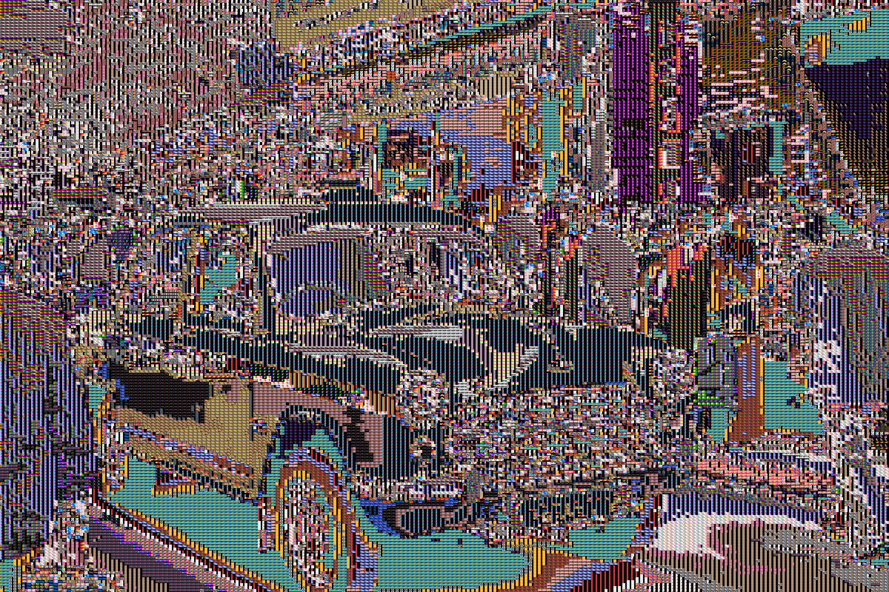        |
|          TSP Art             ||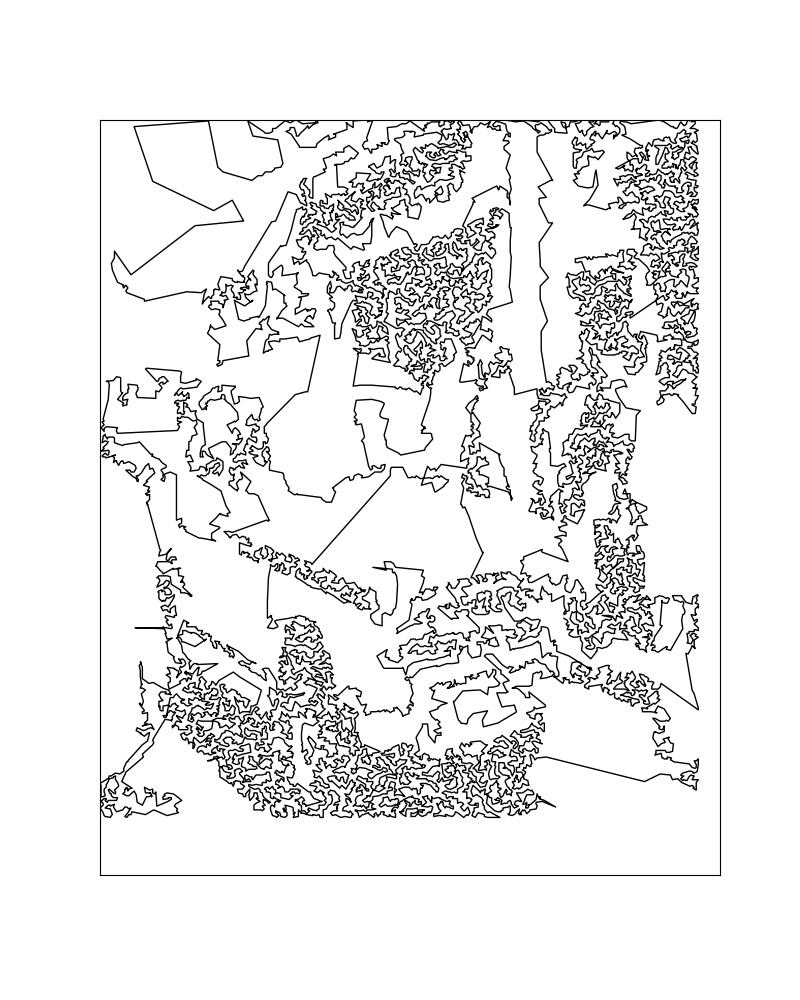       |
|        Cartoon Effect        ||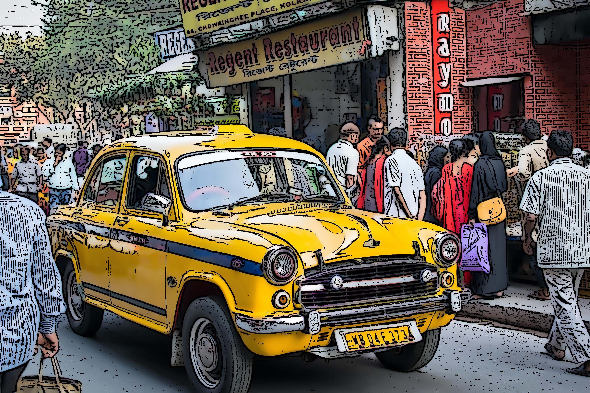      |
|     Comic Cartoon Effect     ||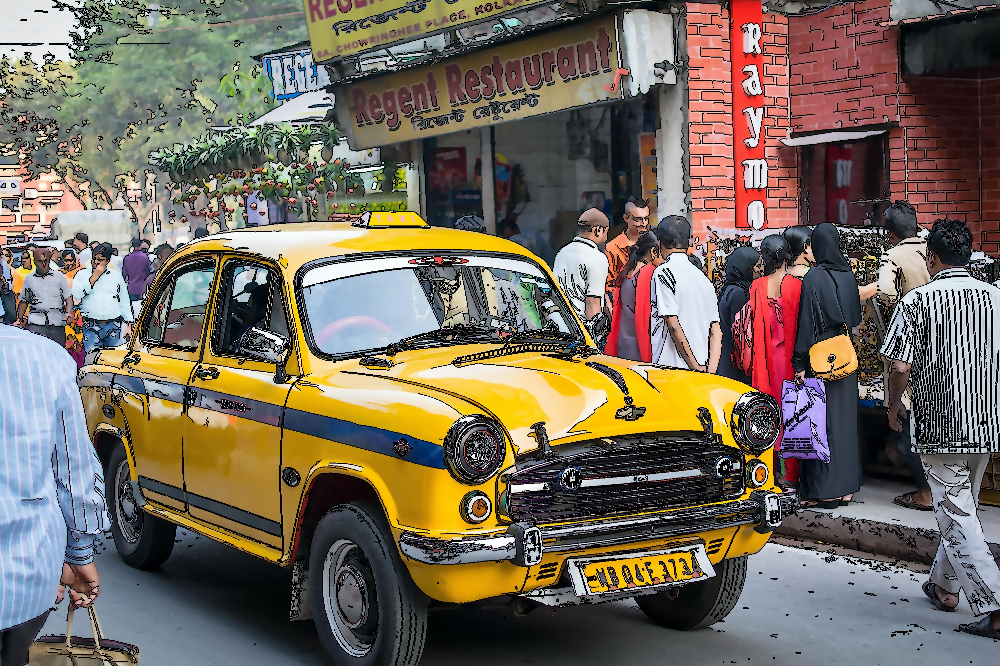|
|     Anime Vintage Effect     ||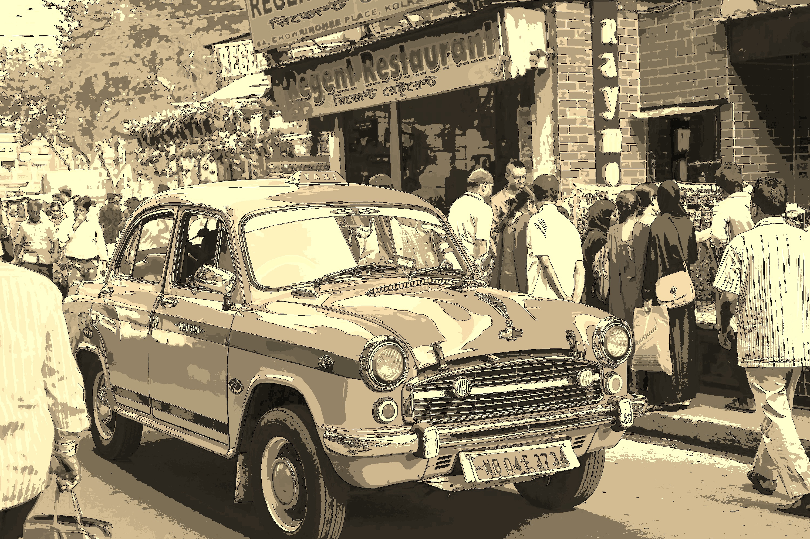|
|         Anime Effect         ||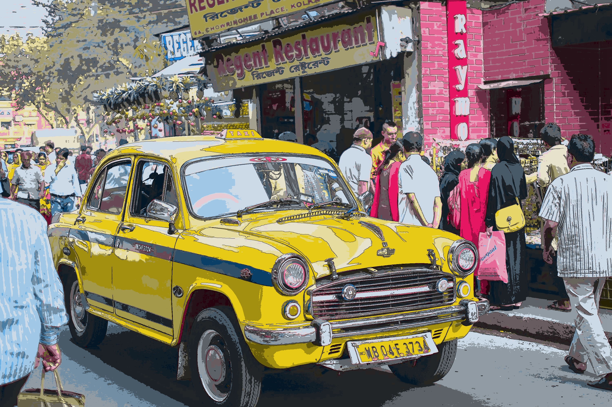  |
|Emboss Effect(Black and White)||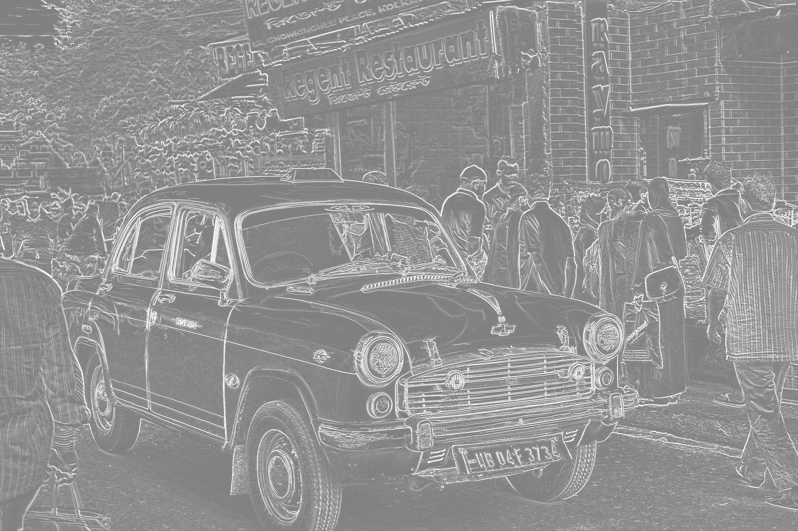|
|    Emboss Effect(Colored)    ||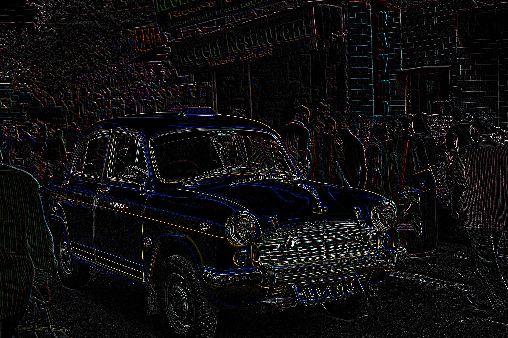|
|          Glitch Art          ||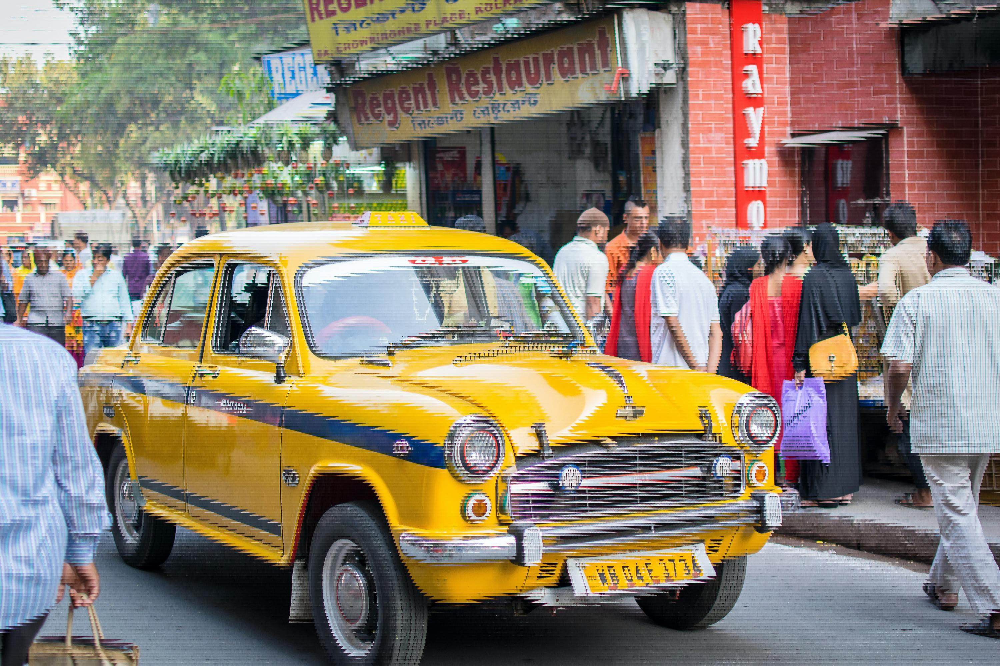|
|     Motion Blur(Vertical)    ||  |
|   Motion Blur (Horizontal)   ||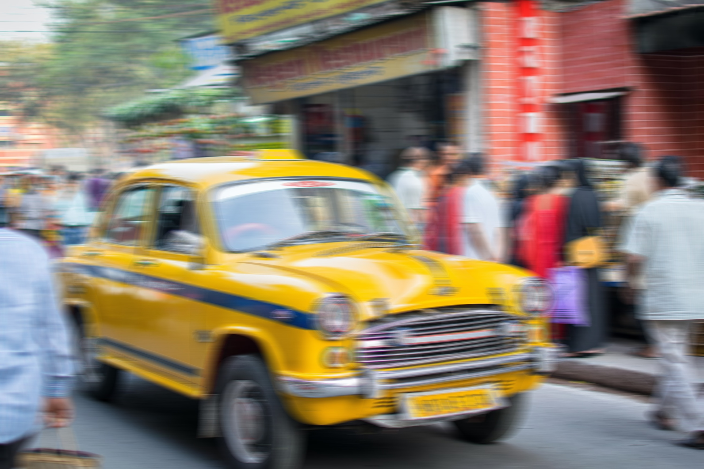  |
|    Motion Blur (Diagonal)    ||  |
|  Color Division Effect(K=3)  |||
|  Color Division Effect(K=6)  |||
|      Sobel Edge detection    ||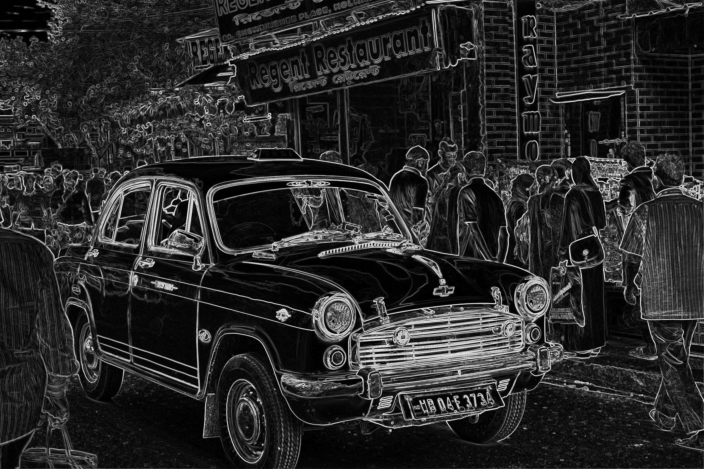  |
|      Negative Roll Effect    ||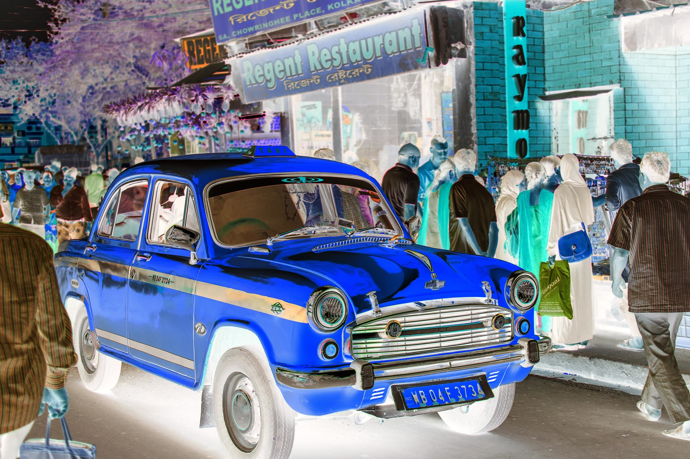  |

** Obtained from [Unsplash](https://unsplash.com/photos/Ab18eGc1hhE)

** Mosaic Images Obtained from [Google Images](https://www.google.com/search?q=colorful+images+jpg&rlz=1C1SQJL_enIN878IN878&sxsrf=ALeKk01p138QfFdbDWis8bPmUTSx02oCSg:1601008796205&source=lnms&tbm=isch&sa=X&ved=2ahUKEwjiwtHEvoPsAhW59XMBHYqrAL8Q_AUoAXoECAwQAw)

<h2 align ='center'>Usage</h2>
Convinced..huh? 😉 and want this spell for yourself?
<p align = 'center'></p>

Here you go:

- Clone or Download this repository ⏬
- Open the Terminal 🐱‍💻
- Move inside 👉 the repo 
```cd ArtCV``` 
- Put your image inside the repo or get its path
- Now make sure you have all the dependencies🧱 
  ```pip install -r requirements.txt```
- Now, the climax you have been waiting for!😎. Run any of the scripts using Terminal
  ```python name_of_effect.py -i <path to your image>```
- Abracadabra ⚡

**I assume you have python installed on your system and set to path.**

<h2 align = 'center'>License 📜</h2>
<p align = 'center'></p>

[MIT License](https://github.com/smaranjitghose/ArtCV/blob/ArtCV/LICENSE)
