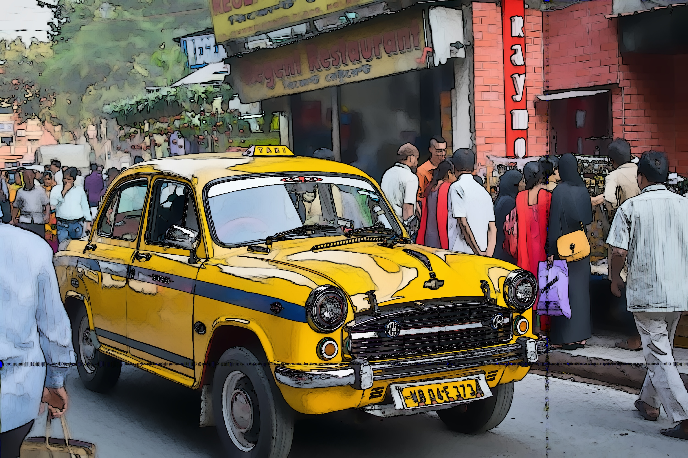
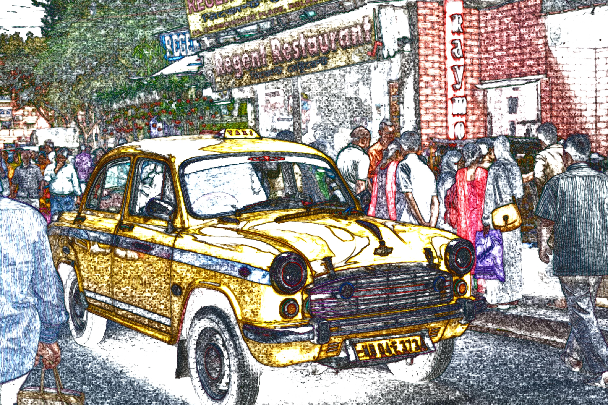
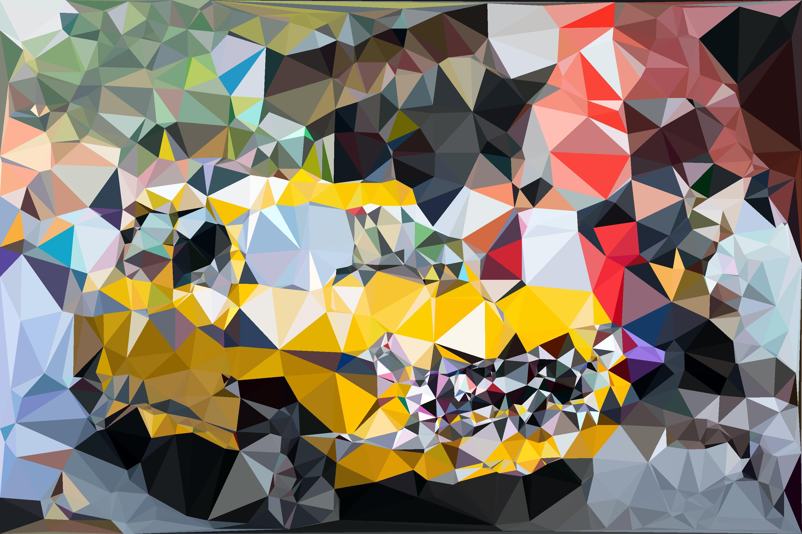
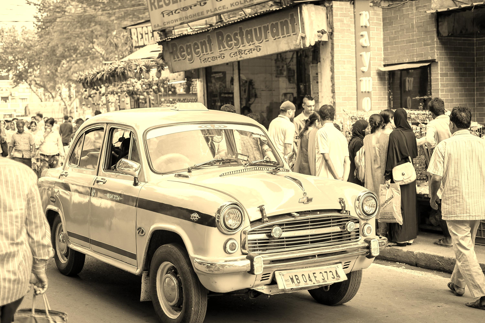
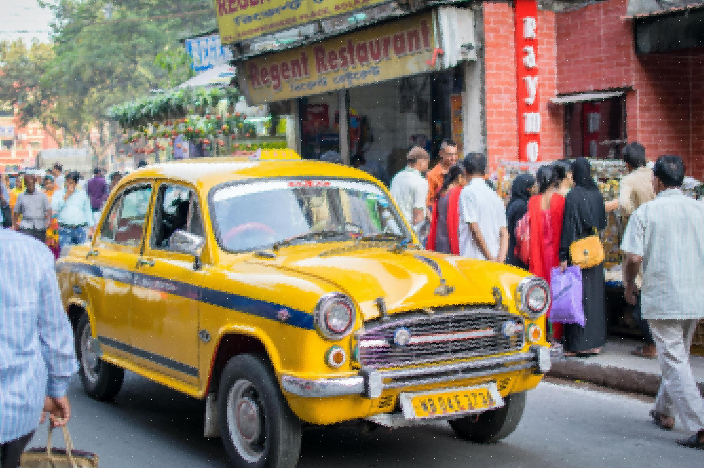

<h1 align = "center"> ART CV🎨</h1>
Do you have a hidden creative artist 🤩 in yourself and never got the opportunity to let it free?
<p align = "center"></p>

Do you love playing around with pictures👩‍🔬?
<p align = "center"></p>

Want to make an eye-catching art piece of yours for a website!
Don’t have time to learn Adobe XD or Pro editor!
But still, want to get things done?
<p align = "center"></p>

Perhaps, Python🐍 can help you out to apply those mesmerizing filters with some basics of image processing!
<p align = "center"></p>


<h2 align = "center">Demo</h2>

|            Work Done         |           Original Image**    |           Output Image                |
|:----------------------------:|:-----------------------------:|:-------------------------------------:|
|         Oil Painting         ||  |
|         Water Coloring        |||
|Pencil Sketch(Black and White)||    |
|    Pencil Sketch(Colored)    ||  |
|          Low Poly            ||      |
|         Sepia Effect         ||  |
|          Pointillism         ||    |
|          Stippling           ||    |

** Obtained from [Unsplash](https://unsplash.com/photos/Ab18eGc1hhE)

<h2 align ='center'>Usage</h2>
Convinced..huh? 😉 and want this spell for yourself?
<p align = 'center'></p>

Here you go:

- Clone or download this repository ⏬
- Open the Terminal 🐱‍💻
- Move inside 👉 the repo 
```cd ArtCV``` 
- Put your image inside the repo or get its path
- Now make sure you have all the dependencies🧱 
  ```pip install -r requirements.txt```
- Now, the climax you have been waiting for!😎. Run any of the scripts using Terminal
  ```python name_of_effect.py -i <path to your image>```
- Abracadabra ⚡

**I assume you have python installed on your system and set to path.**

<h2 align = 'center'>License 📜</h2>
<p align = 'center'></p>

[MIT License](https://github.com/smaranjitghose/ArtCV/blob/ArtCV/LICENSE)
